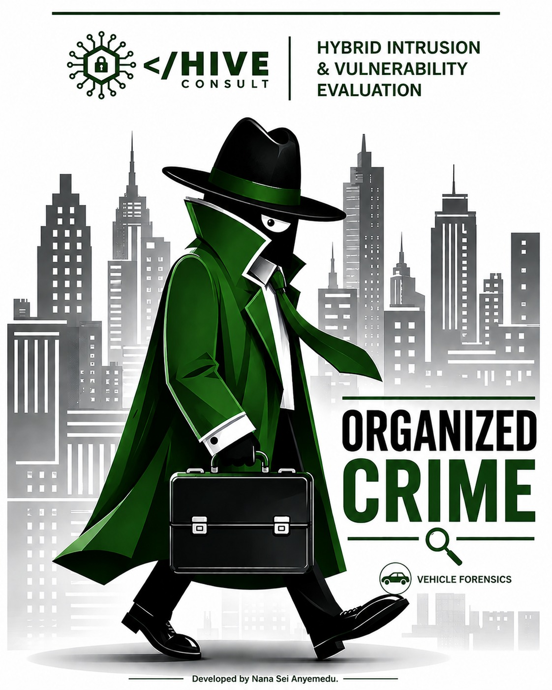

# Operational Forensic Report: Project Cross-Border Heavy
### Case File: OC-GH-2024-DR-0312 - “ORGANIZED CRIME”
### Target Classification: Illicit Inbound Smuggling / Cargo Discrepancy
### Primary Subject: Kwame Boateng Asare

---

## 1. Executive Summary
This repository contains the digital and mechanical forensic reconstruction of an organized smuggling operation operating between Warehouse B4 in the Tema Industrial Area and the Aflao border. Over a ten-week period, the network utilized a legitimate textile transportation front to mask a high-volume inbound contraband pipeline. 

The operation was compromised and dismantled during its eleventh run on 13 December 2024 when the Narcotics Control Commission (NACOC) intercepted the convoy following an anomaly detection profile regarding vehicle return weights.

---

## 2. The Core Assignment
> **Reconstruct the complete eleven-run operation from the vehicle’s internal data (GPS tracks, Bluetooth logs, cargo-door records, EDR, suspension logs, deleted messages, media files, and raw NMEA data) to map the supply chain, timeline, and co-conspirators.**

---

## 3. Network Architecture & Operational Cover

### The Front
* **The Driver:** Kwame Boateng Asare, operating under the guise of a legitimate textile transporter with clean paperwork and plausible manifests.
* **The Asset:** A 2021 Toyota HiAce.
* **The Mask:** Registered under the name of an uninvolved woman, Abena Darko, specifically to disguise its true operator during routine verifications.
* **The Convoy:** A disciplined three-vehicle tactical formation operating exclusively on Friday nights alongside drivers Adjoa Sarpong and Nii Lantey Kwei.

### The Support Structure
* **The Inside Threat:** Kofi Amankwah (Warehouse B4 Handler, Tema Industrial Area), who directly managed the physical loading of the asset.
* **Command & Control (C2):** An unidentified coordinator known only as “Papa Kofi Mensah,” issuing instructions, intelligence, and confirmations via a withheld number.

---

## 4. The Technical Anomaly: The Telematics Trap

The operation maintained strict operational security (OPSEC) on outbound legs, matching declared manifests ranging between 284–357 kg of textile bales. However, telemetry data from the return legs exposed a massive structural payload divergence:

| Metric | Outbound Leg | Return Leg | Variance / Impact |
| :--- | :--- | :--- | :--- |
| **Declared Cargo Weight** | 284–357 kg | Undeclared | N/A |
| **Actual Cargo Weight** | Baseline | 671–836 kg | **Vehicle was 95–143% heavier on return** |
| **Mechanical Footprint** | Normal | Severe Overload | **Fault Code C1A00 Triggered Automatically** |

The subject was entirely unaware that the van’s internal suspension system automatically logs repeated overloads and archives diagnostic trouble code **C1A00**. This permanent digital footprint establishes an undeniable history of heavy inbound smuggling across all eleven iterations.

---

## 5. Timeline & Takedown (Run 11 - 13 December 2024)
* **4 October - 6 December 2024:** Runs 1 through 10. Established a predictable Friday-night pattern of late-night border arrivals.
* **13 December 2024 (Run 11): Interception**
  * **The Tip-Off:** A border officer noticed the recurring pattern of the same three vehicles arriving late on Fridays with drastically heavier return weights and alerted NACOC. The convoy was intercepted at the border.
  * **Compromised Comms:** While being cautioned, Kwame attempted to warn his coordinator via text: *"Delete everything"*. The coordinator responded with an explicit directive: *"Stay silent"*. 
  * **Forensic Status:** Both messages were deleted by the user in real-time but have been completely recovered from the vehicle's integrated transceiver cache.
  * **OPSEC Collapse:** In a state of panic, Kwame tried unsuccessfully to export and erase the vehicle's internal navigation data. Due to an apparent misapprehension of the asset's technical specifications, he searched for deletion instructions for a *Mercedes MBUX* system, despite driving a standard *Toyota* platform. 

The vehicle has been seized and turned over for comprehensive forensic extraction.

---

### Property of HIVE CONSULT
