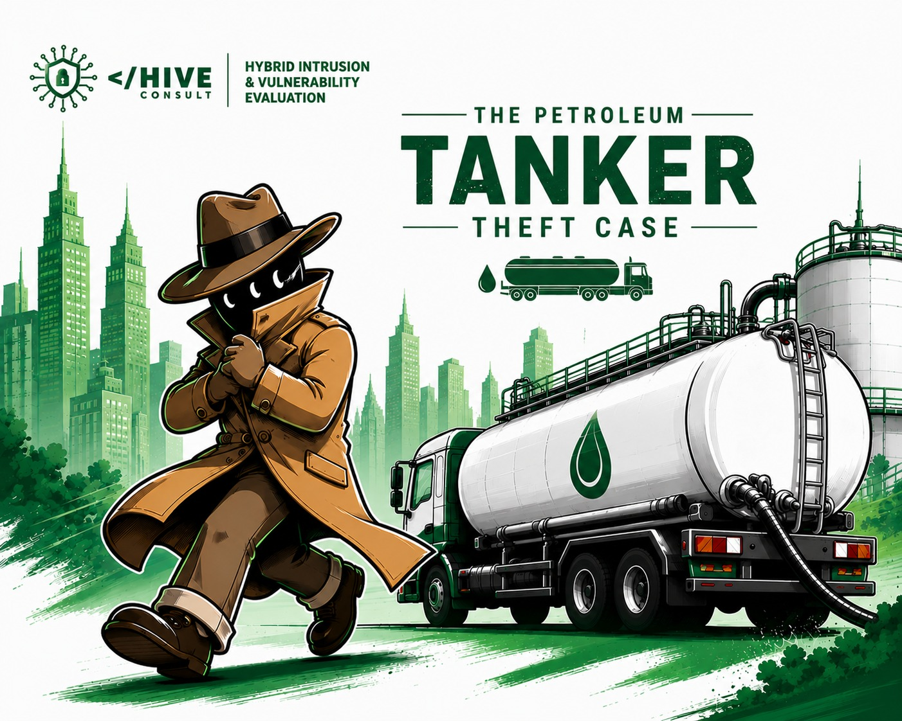

# Operational Forensic Report: Project Liquid Leak
### Case File: Case FT-GH-2024-PT-0188 — The Petroleum Tanker Theft Case
### Target Classification: Systematic Fuel Diversion / Fleet Telematics Fraud
### Primary Subject: Philip Adanse

---

## 1. Executive Summary
This repository houses the digital, telematics, and mechanical forensic reconstruction of a highly organized, multi-week fuel siphoning and diversion operation. Operating along Ghana's strategic N1 highway corridor, a driver entrusted with commercial fuel distribution systematically drained thousands of litres of diesel per run into unlicensed roadside black-market stations before delivering short-loaded cargo to authorized corporate depots.

The illegal pipeline was compromised and dismantled during its eleventh run on 15 November 2024, when an enforcement operation by the Ghana National Petroleum Authority (GNPA) intercepted the asset at a highway weighbridge following heavy structural weight discrepancies.

---

## 2. The Core Assignment
> **Prove that the fuel diversion was deliberate, pre-planned, and systematic using only data recovered from the vehicle's internal Infotainment and Telematics Unit (IVI): the GPS tracks, Power Take-Off (PTO) event logs, fuel sensor records, keyfob cargo door logs, odometer discrepancy tables, and integrated Bluetooth pairing history.**

---

## 3. Network Architecture & Operational Cover

### The Front
* **The Driver:** Philip Adanse, a primary commercial driver for GH Petroleum Company Ltd. He maintained an appearance of compliance by presenting signed delivery manifests and consistent dashboard odometer logs to evade internal suspicion.
* **The Asset:** A commercial petroleum tanker (Registration: **GE-2244-22**), configured to haul 33,000 litres of diesel per run.
* **The Route:** A weekly Friday dispatch originating from the Tema Oil Refinery with three explicit, authorized drop-off points: *Total Energies Kasoa*, *Shell Winneba*, and *Star Oil Agona Swedru*.

### The Illicit Network
* **The Black Market Buyers:** Lina Plange and Maame Esi Adusei, operators of unlicensed, off-grid roadside filling stations located along the N1 transit corridor.
* **The Blindspot:** Fleet Manager Augustine Agyarey and Dispatch Coordinator Nancy Aggrey had no immediate visibility into the fraud due to manual manifest tampering and forged delivery receipts submitted at the close of each run.

---

## 4. The Technical Anomaly: The Telematics Trap

The operation was built on a simple deception: matching the official route distance on paper while secretly altering the physical path. However, the vehicle's internal TruckLink In-Vehicle Infotainment (IVI) and telematics sensors recorded the true mechanical footprint, exposing massive data variances across all 11 runs:

| Metric / Sensor | Driver Logged / Manifested | Telematics (IVI) Actual | Variance / Shortage Impact |
| :--- | :--- | :--- | :--- |
| **Trip Distance (Per Run)** | 185 Kilometers | 242 Kilometers | **+57 km of unauthorized detour per run** |
| **Cargo Volume (Depot)** | 24,000 Litres (Claimed) | 17,000–18,000 Litres | **6,000–7,000 Litres stolen per run** |
| **Weighbridge Mass** | 47,000 Kilograms (Gross) | 28,400 Kilograms | **18,600 kg missing on return leg** |
| **Mechanical Activity** | Normal Transit | PTO Pump Engaged | **Unauthorized fuel transfer events logged** |

The subject completely ignored the fact that the tanker's automated system logs every single deployment of the Power Take-Off (PTO) pump—the mechanical system that transfers engine power to the fuel discharge pumps—alongside exact GPS coordinates and automated fuel level sensor drops. 

---

## 5. Timeline & Takedown (Run 11 — 15 November 2024)
* **6 September — 8 November 2024:** Runs 1 through 10. Established a rigid, systematic Friday pattern of stopping at unlicensed stations, using a compromised cargo keyfob to unlock valves, and pumping out high-grade diesel.
* **15 November 2024 (Run 11): Interception & OPSEC Collapse**
  * **The Trap:** Armed with data on recurring inventory shortages at downstream depots, GNPA Enforcement Officer Daniel Ofori instructed Weighbridge Officer Peter Cage to flag the tanker on its return route.
  * **The Mass Discrepancy:** The weighbridge confirmed a massive deficit—reading nearly 20 tonnes below declared manifest weights, proving the tanker was returning empty after offloading cargo early.
  * **Panic Comms:** Immediately upon being detained at the scale, Philip initiated an emergency mobile call to his primary buyer, Lina Plange, with a direct instruction: *"Delete our messages"*.
  * **Forensic Status:** Following the call, the driver attempted to force a factory reset and partition wipe on the TruckLink IVI system to erase the navigation history. The local export/wipe failed due to system locks. 

The asset was seized under GNPA order **FT-2024-0188** and transferred directly to Julian Derry of **HIVE CONSULT** for deep forensic extraction, cache recovery, and timeline mapping.

---

### Property of HIVE CONSULT
